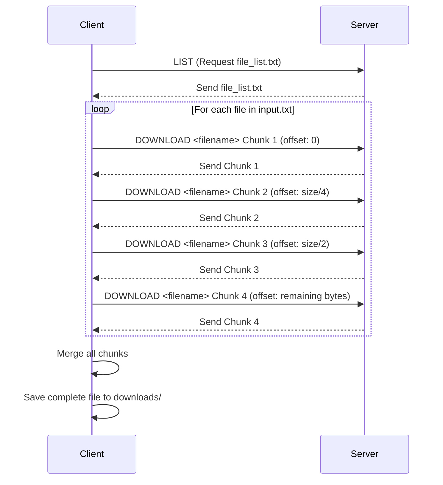
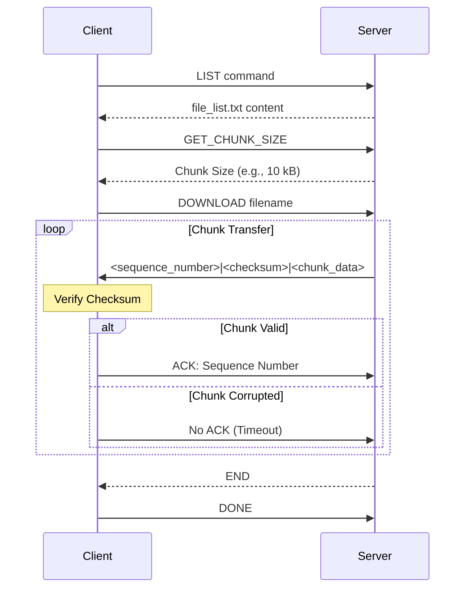

# Socket Programming Project 2024


## Trường Đại học Khoa học Tự nhiên - Đại học Quốc gia TPHCM (HCMUS - VNU)

## Bộ môn Mạng máy tính (Computer Networking)
### Members :
* Nguyễn Trần Phú Quý - 23127113
* Nguyễn Hải Đăng - 23127165
* Lê Nhật Khôi - 23127004

### Content : 
Project : https://docs.google.com/document/d/1ART-HEw2Z0uDu-jkQ1kyZth6CaY6gXQgrOHWDCACGcE/edit?tab=t.0

 Tải các thư viện cần thiết
```bash
pip install -r requirements.txt
```
## Problem 1 : Using TCP to download files


### Set up 
```bash
cd TCP
```

* Tạo thư mục ```server/server_files/``` và add file mà client muốn tải vào đó
* Di chuyển vào đường dẫn ```/server```


* Trên máy server
  ```bash
  python server.py [-h] [--host HOST] [--port PORT]
  ```

* Trên máy client 
  ```bash
  python client.py [-h] [--host HOST] [--port PORT]
  ```
Ghi các tên file client cần tải vào ```client/input.txt```
### Comunication Diagram 

### Demo video
***coming soon***
## Problem 2 : Using UDP to download files


### Set up
```bash
cd UDP
```
* Tạo thư mục ```server/server_files/``` và add file mà client muốn tải vào đó
* Di chuyển vào đường dẫn ```/server```


* Trên máy server
  ```bash
  python server.py [-h] [--host HOST] [--port PORT]
  ```

* Trên máy client 
  ```bash
  python client.py [-h] [--host HOST] [--port PORT]
  ```
Ghi các tên file client cần tải vào ```client/input.txt```
### Comunication Diagram 

### Demo video
 ***coming soon***
